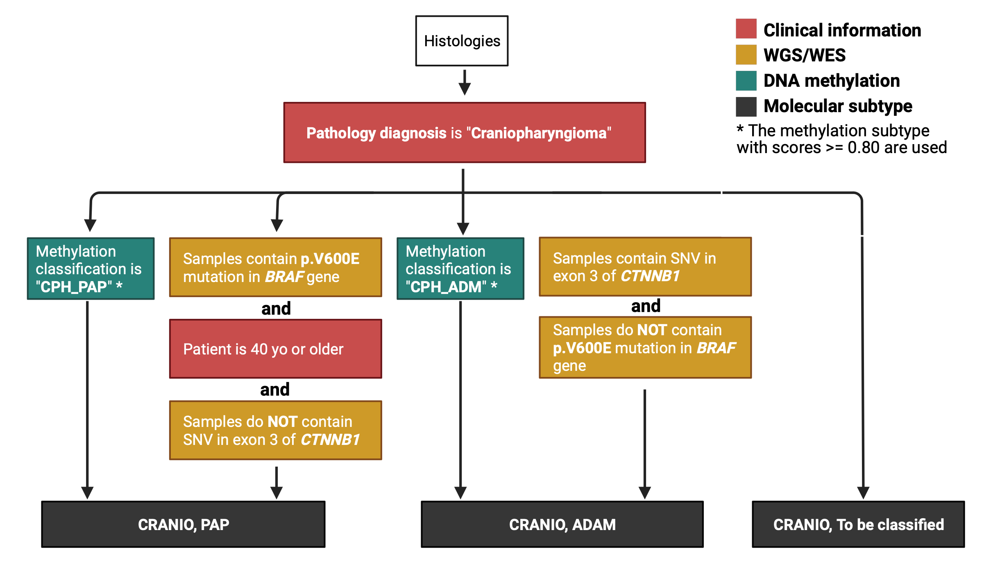

## Molecular Subtyping of Craniopharyngioma 

**Module authors:** Daniel Miller ([@dmiller15](https://github.com/dmiller15)) and Jo Lynne Rokita ([@jharenza](https://github.com/jharenza))

Craniopharyngiomas can be subtyped into adamantinomatous or papillary based on either the specific gene mutations they harboring or the high confident methylation classification.
Adamantinomatous craniopharyngiomas harbor mutations within exon 3 of the _CTNNB1_ gene and papillary craniopharyngiomas harbor BRAF V600E mutations.
Adamantinomatous craniopharyngiomas occur mostly in childhood or young adolescence (0-39 years), but can be seen in adults, while papillary craniopharyngiomas occur exclusively in adults.
This analysis will subtype craniopharyngiomas.

### Usage

This module can be run with the following:

```
bash run-molecular-subtyping-cranio.sh
```

## Molecular subtyping CRANIO workflow

 

### Module contents

`00-craniopharyngiomas-molecular-subtype.Rmd` identifies Kids_First_Biospecimen_ID with relevant mutations, matches WGS sample_id with RNA-Seq sample, and adds molecular_subtypes `CRANIO, ADAM` or `CRANIO, PAP`.
The tabular output (`CRANIO_defining_lesions.tsv`) contains a table with defining lesions and ages for all patients with `pathology_diagnosis == "Craniopharyngioma"`. 
(`results/CRANIO_molecular_subtype.tsv`) contains subtypes for all patients with `pathology_diagnosis == "Craniopharyngioma"`.
