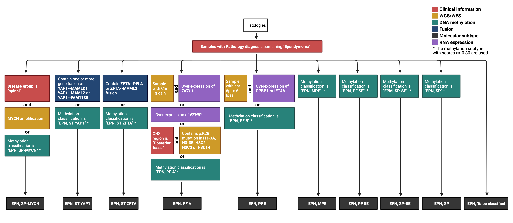

# Molecular Subtyping of Ependymoma

__Module Authors: Teja Koganti__ ([@tkoganti](https://github.com/tkoganti)) and __Josh Shapiro__ ([@jashapiro](https://github.com/jashapiro))

In this analysis we subtype ependymoma (EPN) samples based on the following data: 
- CNS region
- Fusions
- Copy Number Variants (CNVs)
- Gene Expression Data

Additional molecular data included in the module results but not explicitly used in classification include: 
- NFKB_pathway_GSEAscore
- breaks_density-chromosomal_instability_CNV
- breaks_density-chromosomal_instability_SV
- NF2 single nucleotide variant (SNV) data

## Molecular subtyping EPN workflow

 
 

## Usage
`bash run-molecular-subtyping-EPN.sh`

This above  script is designed to change to this directory to run, so it should run from any location.

## Folder content

1. __`00-subset-for-EPN.R`__ is a script that subsets expression data to only include ependymoma samples for CI. The script uses `histologies-base.tsv` file to filter for ependymoma samples and `gene-expression-rsem-tpm-collapsed.rds` file for expression data.

2. __`01-assign-disease-group.R`__ is a script that filters WGS and RNA-seq ependymoma samples from `histologies-base.tsv` file and adds `disease_group` column to the output file based on the primary_site. The values for `disease_group` are: 1) supratentorial, 2) infratentorial, 3) spinal, 4) mixed, and 5) undetermined.

3. __`02_ependymoma_generate_all_data.R`__  is a script that takes in expression, GISTIC, consensus focal CNV, fusion, breakpoint, GSVA, and SNV files to add values from these tables as new columns to the input notebook. Output from `01-assign-disease-group.R` script is used as input notebook. The output notebook from this is saved to `results/EPN_all_data.tsv`

4. __`03-summary.Rmd`__ is a script that takes the table `results/EPN_all_data.tsv`  as input and adds a column that groups the samples into one of the following groups:
    - EPN, ST ZFTA (Supratentorial EPN, _ZFTA_ fusion-positive)
    - EPN, ST YAP1 (Supratentorial EPN, _YAP1_ fusion-positive)
    - EPN, PF A (Posterior Fossa EPN, group PFA)
    - EPN, PF B (Posterior Fossa EPN, group PFB)
    - EPN, SP (Spinal EPN)
    - EPN, SP-MYCN (Spinal EPN, _MYCN_-amplified)
    - EPN, To be classified (i.e., not assigned to other group)

    A new column named `subgroup` is added to the input table and saved in `results/EPN_all_data_withsubgroup.tsv`.

    This script prioritizes features of subgroups first and does not assign those samples to any other subgroups. For example, samples where `disease_group == 'spinal'` are prioritized for the `EPN, SP` or `EPN, SP-MYCN` subgroup, and are not assigned to any other groups. Samples are tested for assignment to subgroups in the following prioritized order shown below. Subgroups inferred from methylation classification are only included where subgroups are not determined (i.e., EPN, To be classified).
    1) EPN, SP-MYCN
    2) EPN, SP
    3) EPN, ST ZFTA
    4) EPN, ST YAP1
    5) EPN, PF A 
    6) EPN, PF B
    7) EPN, PF SE (methylation classificaton)
    8) EPN, SP-SE (methylation classificaton)
    9) EPN, To be classified

    From the [input file here](https://github.com/AlexsLemonade/OpenPBTA-analysis/blob/master/analyses/molecular-subtyping-EPN/results/EPN_all_data.tsv) values for various columns are considered for assigning subgroups. The following criteria are used to prioritize samples for assignment to each group: 
            <table>
                <tr>
                    <th>Subgroup</th>
                    <th>Criteria</th>
                </tr>
                <tr>
                    <td>EPN, SP-MYCN</td>
                    <td>`disease_group == 'spinal'` and `consensus_focal_CN_MYCN == 'amplification'`</td>
                </tr>
                <tr>
                    <td>EPN, SP</td>
                    <td>`disease_group == 'spinal'`</td>
                </tr>
                <tr>
                    <td>EPN, ST ZFTA</td>
                    <td>`ZFTA--RELA == TRUE` or `ZFTA--MAML2 == TRUE`</td>
                </tr>
                <tr>
                    <td>EPN, ST YAP1</td>
                    <td>``YAP1--MAML2 == TRUE` or `YAP1--MAMLD1 == TRUE` or `YAP1--FAM118B == TRUE`</td>
                </tr>
                <tr>
                    <td>EPN, PF A</td>
                    <td>(`1q_gain > 1` and `TKTL1_expr_zscore > 3`) or `EZHIP_expr_zscore > 3` or (`CNS_region == 'Posterior fossa'` and 
      (`H3-3A_HGVSp_Short == 'p.K28M'` or `H3-3B_HGVSp_Short == 'p.K28M'` or `H3C2_HGVSp_Short == 'p.K28M'` or 
         `H3C3_HGVSp_Short == 'p.K28M'` or `H3C14_HGVSp_Short == 'p.K28M'`))</td>
                </tr>
                <tr>
                    <td>EPN, PF B</td>
                    <td>(`6p_loss > 0` or `6q_loss > 0`) and (`GPBP1_expr_zscore > 3` or `IFT46_expr_zscore > 3`)</td>
                </tr>
            </table>

    Additional gene expression, SNV, and CNV values were included in output as they have been shown to be associated with EPN subtypes. However, they were not explicitly used in classifying EPN samples.
            <table>
                <tr>
                    <th>Subtype name</th>
                    <th>Criteria</th>
                </tr>
                <tr>
                    <td>EPN, ST ZFTA</td>
                    <td>`PTEN--TAS2R1 > 0`,   `9p_loss > 0`,   `9q_loss > 0`,   `RELA_expr_zscore > 3`,   `L1CAM_expr_zscore > 3` </td>
                </tr>
                <tr>
                    <td>EPN, ST YAP1</td>
                    <td>`11q_loss > 0`,   `11q_gain > 0`,   `ARL4D_expr_zscore > 3`,   `CLDN1_expr_zscore > 3` </td>
                </tr>
                <tr>
                    <td>EPN, SP</td>
                    <td>`22p_loss > 0`,   `22q_loss > 0`,   Presence of _NF2_ mutations</td>
                </tr>
            </table>  

      The following formula was implemented for the columns `breaks_density-chromosomal_instability_CNV` and `breaks_density-chromosomal_instability_SV` from input table and the values were added as column names `SV instability` and `CNV instability`

                `(break density value for sample - median) / interquartile range`   
