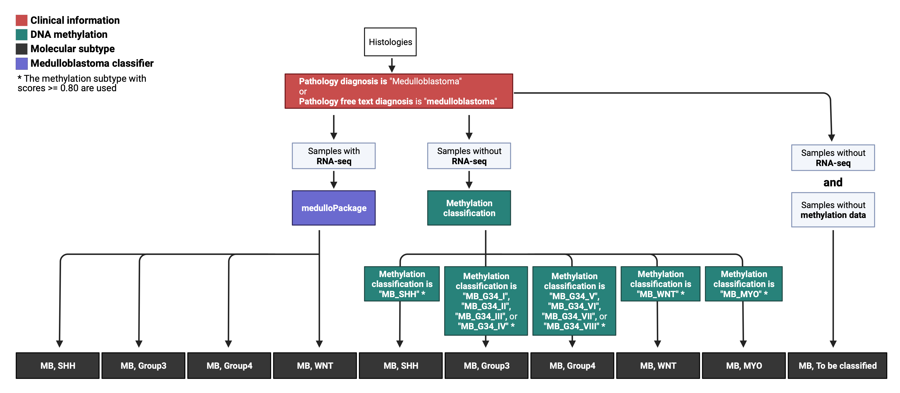

## Molecular Subtype Classification (MB)

**Module authors:** Komal S. Rathi ([@komalsrathi](https://github.com/komalsrathi)) and Jo Lynne Rokita ([@jharenza])(https://github.com/jharenza)

### Description

In OpenPBTA, we used consensus subtypes from the R packages [medulloPackage](https://github.com/d3b-center/medullo-classifier-package) and [MM2S](https://github.com/cran/MM2S) that utilize expression data from RNA-seq or array to classify the medulloblastoma (MB) samples into four subtypes i.e Group3, Group4, SHH, WNT. 
The input is a log-normalized TPM matrix with gene symbols as rownames in case of medulloPackage and entrez ids as rownames in case of MM2S.
Here in OpenPedCan, we utilize [medulloPackage](https://github.com/d3b-center/medullo-classifier-package) since its accuracy (95.35%) was higher than that of MM2S (86.05%). 

## Molecular subtyping MB workflow

 

Note: the detailed information about `medulloPackage` can be found in our [paper](https://journals.plos.org/ploscompbiol/article?id=10.1371/journal.pcbi.1008263). 

### Running the full analysis

This runs 00-04 scripts to create all the output in the `results/` folder.

```sh
bash run-molecular-subtyping-mb.sh
```

### Analysis scripts

#### 00-mb-select-pathology-dx.Rmd

1. Inputs

```
data/histologies-base.tsv
```

2. Function

This Rmd checks creates a terms JSON which is used in the other scripts for subsetting.

3. Output:

A medulloblastoma terms JSON file:
`molecular-subtyping-MB/inputs/mb_subtyping_path_dx_strings.json`

#### 01-filter-and-batch-correction.R

1. Inputs

```
# the rna-seq expression files
data/gene-expression-rsem-tpm-collapsed.rds

# histologies file
data/histologies-base.tsv

# medulloblastoma terms file
molecular-subtyping-MB/inputs/mb_subtyping_path_dx_strings.json
```

2. Function

This script first subsets the input expression matrix to MB samples only and generates a log-normalized TPM matrix.

In case batch-correction of the input matrix is required, we need to set `--batch_col` with the column in the clinical file corresponding to the batch variable. 
For this analysis, we don't need to batch correct the input matrix, so we will be setting `--batch_col` to `NULL`.

3. Output:

```
# subset clinical file to medulloblastoma biospecimens only
input/subset-mb-clinical.tsv

# log-normalized matrix with medulloblastoma biospecimens only
scratch/medulloblastoma-exprs.rds
```

#### 02-classify-mb.R

1. Input

```
# log-normalized matrix with medulloblastoma biospecimens only
scratch/medulloblastoma-exprs.rds
```

2. Function:

This script runs the two classifiers on both uncorrected and batch-corrected input matrices. 
In order to run MM2S, the script utilizes the R package `org.Hs.eg.db`  to convert gene symbols to Entrez ids.

3. Output

```
results/mb-classified.rds
```

The .rds object contains a list of dataframes with outputs corresponding to the twp classifier runs. 
Each dataframe contains 5 columns: sample (Kids_First_Biospecimen_ID), best.fit (i.e. medulloblastoma subtype assigned to the sample), classifier (MM2S or medulloPackage), dataset (corrected or uncorrected matrix) and score (in case of MM2S) or p-value (in case of medulloPackage).  

#### 03-compare-classes.Rmd

1. Input

```
# subset clinical file to medulloblastoma biospecimens only
input/subset-mb-clinical.tsv

# expected output from pathology reports - manually collated by two independent reviewers
input/pbta-mb-pathology-subtypes.tsv

# observed output from 01-classify-mb.R
results/mb-classified.rds
```

2. Function:

This notebook summarizes the performance of the two classifiers on the input expression matrix obtained after running 02-classify-mb.R.

The observed subtypes obtained from each classifier are compared to the expected subtypes in the pathology report in order to determine the classifier accuracy. 
Percent accuracy is calculated by matching observed and expected subtypes only where expected subtype information is available. In case of ambiguous subtypes, a match is determined only if the observed subtype matches with any one of the expected subtypes.

The pathology report has subtype information on 43/122 (35.2%) samples. 
Following is the breakdown of pathology identified subtypes:

| pathology_subtype | freq |
|-------------------|------|
| Group 3 or 4      | 14   |
| Group 4           | 5    |
| non-WNT           | 9    |
| SHH               | 10   |
| WNT               | 5    |

3. Output

The markdown produces one html notebook.

```
# html output
03-compare-classes.html
```

#### 04-subtype-mb-samples.R

1. Input

```
# MB sample subset clinical file
input/subset-mb-clinical.tsv

# observed output from 01-classify-mb.R
results/mb-classified.rds
```

2. Function

This script assigns molecular subtypes for medulloblastoma biospecimens.
- First, a match `id` is created using `sample_id` + `composition`.
- Next, medulloPackage subtypes are assigned to the respective RNA-Seq biospecimen ids.
If there are multiple samples with the same match `id` but different subtype, methylation subtypes are used to determine the correct subtype.
- If there is no RNA-Seq available for a tumor, the methylation subtypes with scores >= 0.80 are used.
- Biospecimens with match `id`s corresponding to those described above are assigned the same subtype.
- Finally, tumors without RNA-Seq or methylation are deemed "MB, To be classified".

##### Accuracy assessment
The last part of this script adds the methylation subtype to the final subtyping file, as well as calculates the accuracy of medulloPackage using methylation subtypes as the true positives.
- Accuracy of medulloPackage was 99.35% (154/155).

3. Output

```
# observed output from 01-classify-mb.R
results/MB_molecular_subtype.tsv
```
