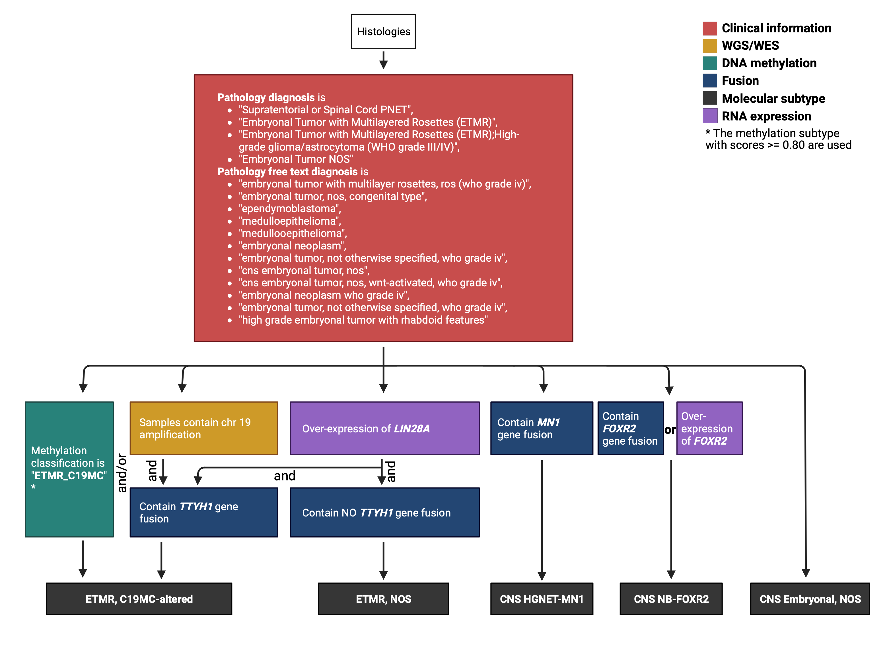

# Molecular Subtyping non-MB, non-ATRT Embryonal Tumors

**Module authors:** Chante Bethell ([@cbethell](https://github.com/cbethell)), Stephanie J. Spielman ([@sjspielman](https://github.com/sjspielman)) and Jaclyn Taroni ([@jaclyn-taroni](https://github.com/jaclyn-taroni))

**Note: The files in the `subset-files` directory were generated via `02-generate-subset-files.R` using the the files in the [version 17 data release](https://github.com/AlexsLemonade/OpenPBTA-analysis/pull/764).**

<!-- START doctoc generated TOC please keep comment here to allow auto update -->
<!-- DON'T EDIT THIS SECTION, INSTEAD RE-RUN doctoc TO UPDATE -->
**Table of Contents**  *generated with [DocToc](https://github.com/thlorenz/doctoc)*

- [Usage](#usage)
- [Folder Content](#folder-content)
  - [Define samples for subsetting](https://alexslemonade.github.io/OpenPBTA-analysis/analyses/molecular-subtyping-embryonal/01-samples-to-subset.nb.html)
  - [Generate subset files](https://github.com/AlexsLemonade/OpenPBTA-analysis/blob/master/analyses/molecular-subtyping-embryonal/02-generate-subset-files.R)
  - [Clean C19MC miRNA cluster data](https://alexslemonade.github.io/OpenPBTA-analysis/analyses/molecular-subtyping-embryonal/03-clean-c19mc-data.nb.html)
  - [Construct summary tables](https://alexslemonade.github.io/OpenPBTA-analysis/analyses/molecular-subtyping-embryonal/04-table-prep.nb.html)
- [Folder Structure](#folder-structure)

<!-- END doctoc generated TOC please keep comment here to allow auto update -->

## Usage

When re-running this module, you may want to regenerate the subset files using the most recent data release.
Files will be regenerated using the symlinked files in `data` by default when running from the command line as follows:

```
bash run-embryonal-subtyping.sh
```

`00-embryonal-select-pathology-dx.Rmd` is not run via this module's shell script, as it should be run locally, tied to `release-v17-20200908`, and should not be re-rendered when there are changes to the underlying `pbta-histologies.tsv` file in future releases (see [Folder content](#folder-content) and [#748](https://github.com/AlexsLemonade/OpenPBTA-analysis/issues/748)).

## Molecular subtyping HGG workflow

 


## Molecular subtyping criterias

First, samples was selected based on the pathology-diagnosis and pathologies_free_text-diagnosis in this [script](./00-embryonal-select-pathology-dx.R). To molecular subtype embryonal tumors, following criteria is used based on WHO cancer guidebook: 

- **ETMR, C19MC-altered**: samples contain chromosome 19 amplification or the overexpression of _LIN28A_ and contain _TTYH1_ gene fusion;
- **ETMR, NOS**: samples contain NO _TTYH1_ gene sufion and the overexpression of _LIN28A_. 
- **CNS HGNET-MN1**: samples contain _MN1_ gene fusion.
- **CNS NB-FOXR2**: samples contain _FOXR2_ gene fusion or the overexpression of _FOXR2_.
- **CNS Embryonal, NOS**: Pathology diagnosis is "Neuroblastoma" and do NOT have high confidence methylation subtypes.
- For all the other samples with Pathology diagnosis of "Neuroblastoma" and have high confidence methylation subtypes, molecular subtypes of these samples follow their methylation molecular subtypes.


## Folder Content

[`00-embryonal-select-pathology-dx.R`](https://alexslemonade.github.io/OpenPBTA-analysis/analyses/molecular-subtyping-embryonal/00-embryonal-select-pathology-dx.R)
in this script we gather relevant strings from the summarized results above and histology updates review and save in [`subset-files/embryonal_subtyping_path_dx_strings.json`](subset-files/embryonal_subtyping_path_dx_strings.json), which is used downstream in `01-samples-to-subset.Rmd` to identify the samples to include in the subset files.

[`01-samples-to-subset.Rmd`](https://alexslemonade.github.io/OpenPBTA-analysis/analyses/molecular-subtyping-embryonal/01-samples-to-subset.nb.html) is a notebook written to identify samples to include in subset files for the purpose of molecularly subtyping non-MB and non-ATRT embryonal tumors.
The samples are identified using the following criteria:

1. An RNA-seq biospecimen sample includes a _TTYH1_ fusion (5' partner) [per this comment](https://github.com/AlexsLemonade/OpenPBTA-analysis/pull/401#issuecomment-573669727).
2. An RNA-seq biospecimen sample includes a _MN1_ fusion (5' partner) [per this comment](https://github.com/AlexsLemonade/OpenPBTA-analysis/pull/785#issuecomment-695015488).
Note that the `MN1--PATZ1` fusion is excluded as it is an entity separate of CNS HGNET-MN1 tumors [per this comment](https://github.com/AlexsLemonade/OpenPBTA-analysis/pull/788#discussion_r495302880).
3. Any sample with "Supratentorial or Spinal Cord PNET" or "Embryonal Tumor with Multilayered Rosettes" in the `pathology_diagnosis` column of the metadata `pbta-histologies.tsv` [per this comment](https://github.com/AlexsLemonade/OpenPBTA-analysis/issues/752#issuecomment-697000066) and [#1030](https://github.com/AlexsLemonade/OpenPBTA-analysis/issues/1030).
4. Any sample with "Neuroblastoma" in the `pathology_diagnosis` column, where `primary_site` does not contain "Other locations NOS", `pathology_free_text_diagnosis` does not contain "peripheral" or "metastatic" [per the same comment as above](https://github.com/AlexsLemonade/OpenPBTA-analysis/issues/752#issuecomment-697000066) and [this comment](https://github.com/AlexsLemonade/OpenPBTA-analysis/pull/788#discussion_r499948141).
5. Any sample with "Other" in the `pathology_diagnosis` column of the metadata, and with "embryonal tumor with multilayer rosettes, ros (who grade iv)", "embryonal tumor, nos, congenital type", "ependymoblastoma" or "medulloepithelioma" in the `pathology_free_text_diagnosis` column [per this comment](https://github.com/AlexsLemonade/OpenPBTA-analysis/issues/752#issuecomment-697000066).
The output of this notebook is a TSV file, named `biospecimen_ids_embryonal_subtyping.tsv`, containing the biospeciemen IDs identified based on the above criteria (stored in the `results` directory of this module.

[`02-generate-subset-files.R`](https://github.com/AlexsLemonade/OpenPBTA-analysis/blob/master/analyses/molecular-subtyping-embryonal/02-generate-subset-files.R) is a script written to subset the files required for the subtyping of non-MB and non-ATRT embryonal tumors, using the output of `01-samples-to-subset.Rmd`.
The output of this script includes the subsets of the structural variant, poly-A RNA-seq, and stranded RNA-seq data files (stored in the `subset-files` directory of this module).

[`03-clean-c19mc-data.Rmd`](https://alexslemonade.github.io/OpenPBTA-analysis/analyses/molecular-subtyping-embryonal/03-clean-c19mc-data.nb.html) is a notebook written to clean copy number data related to C19MC amplifications in non-MB, non-ATRT embryonal tumors.
Specifically, the goal of this notebook is to identify embryonal tumors with multilayered rosettes (ETMR), C19MC-altered tumors.
This is done by filtering the consensus copy number calls (found at `analyses/copy_number_consensus_call/results/pbta-cnv-consensus.seg.gz`) to segments on chromosome 19 with a positive `seg.mean`.
We are interested in the focal amplifications here because the amplification of C19MC, the miRNA cluster on chromosome 19, is a suggested characteristic of ETMRs as noted [here](https://github.com/AlexsLemonade/OpenPBTA-analysis/issues/251#issue-520154478).
In this notebook, we also visualize the width of the focal amplifications found to ensure that they overlap as there is disagreement about the genomic location of C19MC [per this comment](https://github.com/AlexsLemonade/OpenPBTA-analysis/pull/458#issuecomment-581050051).
The output of this notebook is a cleaned TSV file, named `cleaned_chr19_cn.tsv`, containing a binary column indicating whether or not each biospecimen ID identified in `01-samples-to-subset.Rmd` is associated with chromosome 19 amplification (stored in the `results` directory of this module).

[`04-table-prep.Rmd`](https://alexslemonade.github.io/OpenPBTA-analysis/analyses/molecular-subtyping-embryonal/04-table-prep.nb.html) is a notebook written to construct tables that summarize the data relevant to the molecular subtyping of non-MB and non-ATRT embryonal tumors per the information provided on the reference GitHub issue [#251](https://github.com/AlexsLemonade/OpenPBTA-analysis/issues/251).
The output of this notebook includes two TSV files, both found in the `results` directory of this module.
The first output file, `embryonal_tumor_subtyping_relevant_data.tsv`, contains a summary table of the data subsetted in `02-generate-subset-files.R`, as well as relevant fusion and copy number data for the purpose of molecular subtyping embryonal tumors.
The second output file, `embryonal_tumor_molecular_subtypes.tsv`, contains the molecular subtype information of the identified biospecimen IDs based on the summarized relevant data as described in the [original comment](https://github.com/AlexsLemonade/OpenPBTA-analysis/issues/251#issue-520154478) and in [this comment](https://github.com/AlexsLemonade/OpenPBTA-analysis/issues/251#issuecomment-571807158) both found on the reference GitHub issue.
The information in this file is represented in table with the following columns:


| `Kids_First_Participant_ID` | `sample_id` | `Kids_First_Biospecimen_ID_DNA` | `Kids_First_Biospecimen_ID_RNA` | `Kids_First_Biospecimen_ID_Methyl` | `molecular_subtype` | `molecular_subtype_methyl` |
|-----------------------------|-------------|---------------------------------|---------------------------------|------------------------------------|---------------------|----------------------------|


## Folder Structure

```
├── 00-embryonal-select-pathology-dx.Rmd
├── 00-embryonal-select-pathology-dx.nb.html
├── 01-samples-to-subset.Rmd
├── 01-samples-to-subset.nb.html
├── 02-generate-subset-files.R
├── 03-clean-c19mc-data.Rmd
├── 03-clean-c19mc-data.nb.html
├── 04-table-prep.Rmd
├── 04-table-prep.nb.html
├── README.md
├── results
│   ├── biospecimen_ids_embryonal_subtyping.tsv
│   ├── cleaned_chr19_cn.tsv
│   ├── embryonal_tumor_molecular_subtypes.tsv
│   └── embryonal_tumor_subtyping_relevant_data.tsv
\u2502   \u2514\u2500\u2500  methyl_embryonal_subtyping.tsv
├── run-embryonal-subtyping.sh
└── subset-files
    ├── embryonal_manta_sv.tsv
    ├── embryonal_subtyping_path_dx_strings.json
    ├── embryonal_zscored_exp.polya.rds
    └── embryonal_zscored_exp.stranded.rds
```
