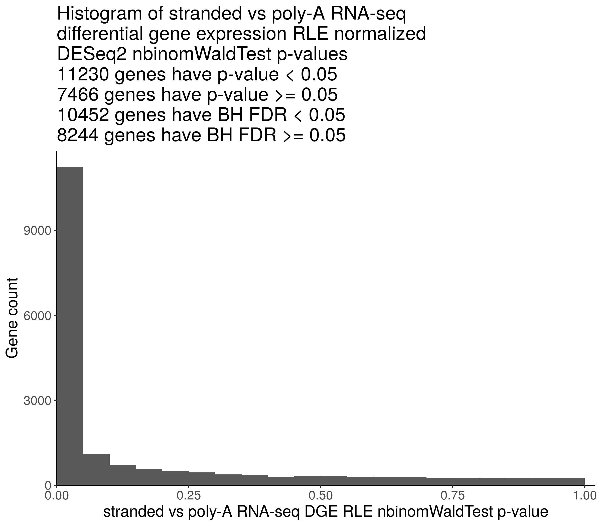
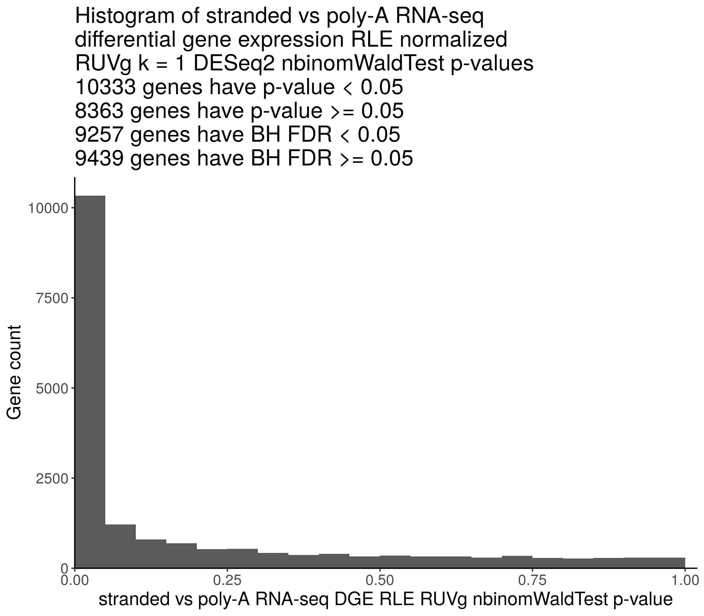
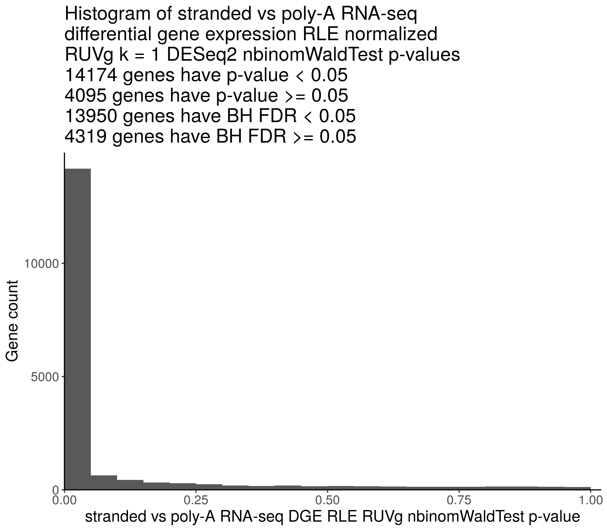
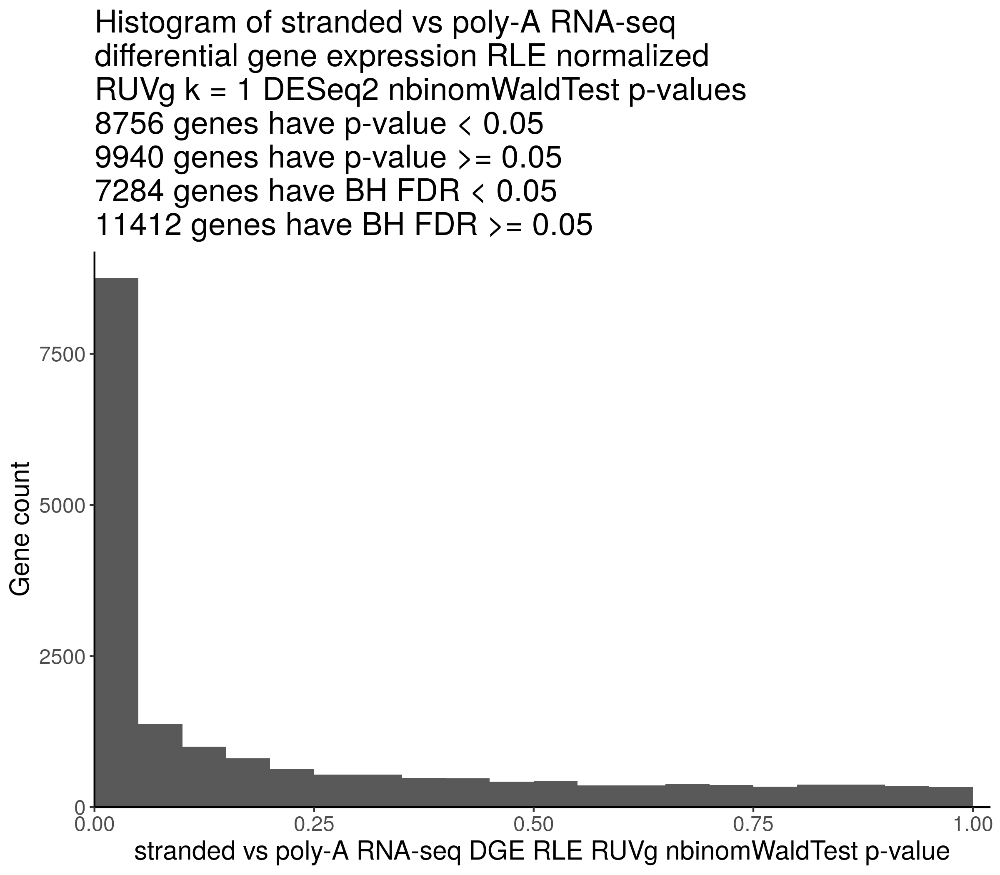
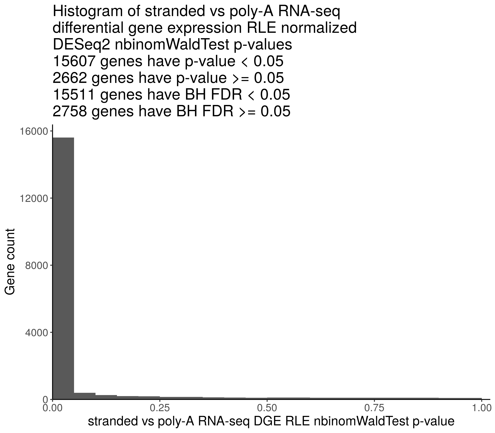

# Evaluate the use of empirical negative control genes for batch correction <!-- omit in toc -->

- [1. Purpose](#1-purpose)
- [2. Methods](#2-methods)
- [3. Results](#3-results)
  - [3.1. Use `../rna-seq-protocol-dge/results/uqpgq2_normalized/stranded_vs_polya_stably_exp_genes.csv` as empirical negative gene set for `RUVSeq::RUVg` batch effect estimation](#31-use-rna-seq-protocol-dgeresultsuqpgq2_normalizedstranded_vs_polya_stably_exp_genescsv-as-empirical-negative-gene-set-for-ruvseqruvg-batch-effect-estimation)
    - [3.1.1. RNA-seq libraries with matching `sample_id`s](#311-rna-seq-libraries-with-matching-sample_ids)
    - [3.1.2. DIPG RNA-seq libraries without matching `sample_id`s](#312-dipg-rna-seq-libraries-without-matching-sample_ids)
    - [3.1.3. NBL RNA-seq libraries](#313-nbl-rna-seq-libraries)
  - [3.2. Use significant genes with `BH FDR` < 0.05 `../rna-seq-protocol-dge/results/deseq2_rle_normalized/stranded_vs_polya_dge_deseq2_nbinom_wald_test_res.csv` as empirical negative gene set for `RUVSeq::RUVg` batch effect estimation](#32-use-significant-genes-with-bh-fdr--005-rna-seq-protocol-dgeresultsdeseq2_rle_normalizedstranded_vs_polya_dge_deseq2_nbinom_wald_test_rescsv-as-empirical-negative-gene-set-for-ruvseqruvg-batch-effect-estimation)
    - [3.2.1. RNA-seq libraries with matching `sample_id`s](#321-rna-seq-libraries-with-matching-sample_ids)
    - [3.2.2. DIPG RNA-seq libraries without matching `sample_id`s](#322-dipg-rna-seq-libraries-without-matching-sample_ids)
    - [3.2.3. NBL RNA-seq libraries](#323-nbl-rna-seq-libraries)
- [4. Usage](#4-usage)
- [5. Module structure](#5-module-structure)
- [6. Analysis scripts](#6-analysis-scripts)
  - [6.1. 01-protocol-ruvseq.R](#61-01-protocol-ruvseqr)

## 1. Purpose

Evaluate the effectiveness of using empirically defined negative control housekeeping genes for batch effect correction. The empirically defined negative control housekeeping genes show stable expression levels in poly-A and ribo-deplete-stranded RNA-seq libraries prepared from the same biological samples, which are selected in the [PR 11](https://github.com/PediatricOpenTargets/OpenPedCan-analysis/pull/11).

## 2. Methods

1. Select ribo-deplete-stranded and poly-A RNA-seq libraries that are expected to have no significant differences in gene expression profiles.
    1. RNA-seq libraries with matching `sample_id`s:
        | Kids_First_Biospecimen_ID | sample_id | experimental_strategy | RNA_library | cohort|
        |---------------------------|-----------|-----------------------|-------------|--------|
        | BS_HE0WJRW6               | 7316-1455 | RNA-Seq               | stranded    | CBTN|
        | BS_HWGWYCY7               | 7316-1455 | RNA-Seq               | poly-A      | CBTN|
        | BS_SHJA4MR0               | 7316-161  | RNA-Seq               | stranded    | CBTN|
        | BS_X0XXN9BK               | 7316-161  | RNA-Seq               | poly-A      | CBTN|
        | BS_FN07P04C               | 7316-255  | RNA-Seq               | stranded    | CBTN|
        | BS_W4H1D4Y6               | 7316-255  | RNA-Seq               | poly-A      | CBTN|
        | BS_8QB4S4VA               | 7316-536  | RNA-Seq               | stranded    | CBTN|
        | BS_QKT3TJVK               | 7316-536  | RNA-Seq               | poly-A      | CBTN|
        | BS_7WM3MNZ0               | A16915    | RNA-Seq               | poly-A      | PNOC003|
        | BS_KABQQA0T               | A16915    | RNA-Seq               | stranded    | PNOC003|
        | BS_68KX6A42               | A18777    | RNA-Seq               | poly-A      | PNOC003|
        | BS_D7XRFE0R               | A18777    | RNA-Seq               | stranded    | PNOC003|
    2. Diffuse intrinsic pontine glioma (DIPG) libraries without matching `sample_id`s, as suggested by [@jharenza](https://github.com/jharenza) at <https://github.com/PediatricOpenTargets/ticket-tracker/issues/39#issuecomment-859751927>.
    3. Neuroblastoma (NBL) libraries, as suggested by [@jharenza](https://github.com/jharenza) at <https://github.com/PediatricOpenTargets/ticket-tracker/issues/39#issuecomment-859751927>.
2. Run DESeq2 default differential gene expression (DGE) analysis to compare ribo-deplete-stranded and poly-A RNA-seq `rsem-expected_count`s.
3. Run DESeq2 DGE analysis with RUVSeq estimated batch effect in the design to compare ribo-deplete-stranded and poly-A RNA-seq `rsem-expected_count`s. The batch effect is estimated using [empirically defined negative control housekeeping genes](https://github.com/logstar/OpenPedCan-analysis/blob/rna-seq-protocol-dge-fourth/analyses/rna-seq-protocol-dge/results/uqpgq2_normalized/stranded_vs_polya_stably_exp_genes.csv), using the RUVg workflow demonstrated in the section "2.4 Empirical control genes" in the [RUVSeq vignette](https://bioconductor.riken.jp/packages/3.0/bioc/vignettes/RUVSeq/inst/doc/RUVSeq.pdf).
4. Plot the distributions of DGE p-values computed from step 2 and 3.

## 3. Results

The results were generated using v7 release data.

### 3.1. Use `../rna-seq-protocol-dge/results/uqpgq2_normalized/stranded_vs_polya_stably_exp_genes.csv` as empirical negative gene set for `RUVSeq::RUVg` batch effect estimation

#### 3.1.1. RNA-seq libraries with matching `sample_id`s

**DGE without RUVSeq estimated batch effect:**


The DGE result table is at `results/stably-expressed-genes-as-negative-control/matched_sample_ids/stranded_vs_polya_dge_deseq2_nbinom_wald_test_res.csv`.

**DGE with RUVSeq estimated batch effect:**


The DGE result table is at `results/stably-expressed-genes-as-negative-control/matched_sample_ids/stranded_vs_polya_dge_ruvg_k1_deseq2_nbinom_wald_test_res.csv`.

#### 3.1.2. DIPG RNA-seq libraries without matching `sample_id`s

**DGE without RUVSeq estimated batch effect:**



The DGE result table is at `results/stably-expressed-genes-as-negative-control/dipg_rm_matched_sample_ids/stranded_vs_polya_dge_deseq2_nbinom_wald_test_res.csv`.

**DGE with RUVSeq estimated batch effect:**



The DGE result table is at `results/stably-expressed-genes-as-negative-control/dipg_rm_matched_sample_ids/stranded_vs_polya_dge_ruvg_k1_deseq2_nbinom_wald_test_res.csv`.

#### 3.1.3. NBL RNA-seq libraries

**DGE without RUVSeq estimated batch effect:**


The DGE result table is at `results/stably-expressed-genes-as-negative-control/nbl/stranded_vs_polya_dge_deseq2_nbinom_wald_test_res.csv`.

**DGE with RUVSeq estimated batch effect:**



The DGE result table is at `results/stably-expressed-genes-as-negative-control/nbl/stranded_vs_polya_dge_ruvg_k1_deseq2_nbinom_wald_test_res.csv`.

### 3.2. Use significant genes with `BH FDR` < 0.05 `../rna-seq-protocol-dge/results/deseq2_rle_normalized/stranded_vs_polya_dge_deseq2_nbinom_wald_test_res.csv` as empirical negative gene set for `RUVSeq::RUVg` batch effect estimation

#### 3.2.1. RNA-seq libraries with matching `sample_id`s

**DGE without RUVSeq estimated batch effect:**


The DGE result table is at `results/deseq2-significant-house-keeping-genes-as-negative-control/matched_sample_ids/stranded_vs_polya_dge_deseq2_nbinom_wald_test_res.csv`.

**DGE with RUVSeq estimated batch effect:**


The DGE result table is at `results/deseq2-significant-house-keeping-genes-as-negative-control/matched_sample_ids/stranded_vs_polya_dge_ruvg_k1_deseq2_nbinom_wald_test_res.csv`.

#### 3.2.2. DIPG RNA-seq libraries without matching `sample_id`s

**DGE without RUVSeq estimated batch effect:**


The DGE result table is at `results/deseq2-significant-house-keeping-genes-as-negative-control/dipg_rm_matched_sample_ids/stranded_vs_polya_dge_deseq2_nbinom_wald_test_res.csv`.

**DGE with RUVSeq estimated batch effect:**



The DGE result table is at `results/deseq2-significant-house-keeping-genes-as-negative-control/dipg_rm_matched_sample_ids/stranded_vs_polya_dge_ruvg_k1_deseq2_nbinom_wald_test_res.csv`.

#### 3.2.3. NBL RNA-seq libraries

**DGE without RUVSeq estimated batch effect:**



The DGE result table is at `results/deseq2-significant-house-keeping-genes-as-negative-control/nbl/stranded_vs_polya_dge_deseq2_nbinom_wald_test_res.csv`.

**DGE with RUVSeq estimated batch effect:**


The DGE result table is at `results/deseq2-significant-house-keeping-genes-as-negative-control/nbl/stranded_vs_polya_dge_ruvg_k1_deseq2_nbinom_wald_test_res.csv`.

## 4. Usage

1. Change working directory to local `OpenPedCan-analysis`.
2. Download data using `bash download-data.sh`.
3. Run this analysis module in the continuous integration (CI) docker image using `./scripts/run_in_ci.sh bash analyses/rna-seq-protocol-ruvseq/run-rna-seq-protocol-ruvseq.sh`.

## 5. Module structure

```text
.
├── 01-protocol-ruvseq.R
├── README.md
├── plots
│   ├── deseq2-significant-house-keeping-genes-as-negative-control
│   │   ├── dipg_rm_matched_sample_ids
│   │   │   ├── stranded_vs_polya_dge_deseq2_nbinom_wald_test_pvals_histogram.png
│   │   │   └── stranded_vs_polya_dge_ruvg_k1_deseq2_nbinom_wald_test_pvals_histogram.png
│   │   ├── matched_sample_ids
│   │   │   ├── stranded_vs_polya_dge_deseq2_nbinom_wald_test_pvals_histogram.png
│   │   │   └── stranded_vs_polya_dge_ruvg_k1_deseq2_nbinom_wald_test_pvals_histogram.png
│   │   └── nbl
│   │       ├── stranded_vs_polya_dge_deseq2_nbinom_wald_test_pvals_histogram.png
│   │       └── stranded_vs_polya_dge_ruvg_k1_deseq2_nbinom_wald_test_pvals_histogram.png
│   └── stably-expressed-genes-as-negative-control
│       ├── dipg_rm_matched_sample_ids
│       │   ├── stranded_vs_polya_dge_deseq2_nbinom_wald_test_pvals_histogram.png
│       │   └── stranded_vs_polya_dge_ruvg_k1_deseq2_nbinom_wald_test_pvals_histogram.png
│       ├── matched_sample_ids
│       │   ├── stranded_vs_polya_dge_deseq2_nbinom_wald_test_pvals_histogram.png
│       │   └── stranded_vs_polya_dge_ruvg_k1_deseq2_nbinom_wald_test_pvals_histogram.png
│       └── nbl
│           ├── stranded_vs_polya_dge_deseq2_nbinom_wald_test_pvals_histogram.png
│           └── stranded_vs_polya_dge_ruvg_k1_deseq2_nbinom_wald_test_pvals_histogram.png
├── results
│   ├── deseq2-significant-house-keeping-genes-as-negative-control
│   │   ├── dipg_rm_matched_sample_ids
│   │   │   ├── stranded_vs_polya_dge_deseq2_nbinom_wald_test_res.csv
│   │   │   └── stranded_vs_polya_dge_ruvg_k1_deseq2_nbinom_wald_test_res.csv
│   │   ├── matched_sample_ids
│   │   │   ├── stranded_vs_polya_dge_deseq2_nbinom_wald_test_res.csv
│   │   │   └── stranded_vs_polya_dge_ruvg_k1_deseq2_nbinom_wald_test_res.csv
│   │   └── nbl
│   │       ├── stranded_vs_polya_dge_deseq2_nbinom_wald_test_res.csv
│   │       └── stranded_vs_polya_dge_ruvg_k1_deseq2_nbinom_wald_test_res.csv
│   └── stably-expressed-genes-as-negative-control
│       ├── dipg_rm_matched_sample_ids
│       │   ├── stranded_vs_polya_dge_deseq2_nbinom_wald_test_res.csv
│       │   └── stranded_vs_polya_dge_ruvg_k1_deseq2_nbinom_wald_test_res.csv
│       ├── matched_sample_ids
│       │   ├── stranded_vs_polya_dge_deseq2_nbinom_wald_test_res.csv
│       │   └── stranded_vs_polya_dge_ruvg_k1_deseq2_nbinom_wald_test_res.csv
│       └── nbl
│           ├── stranded_vs_polya_dge_deseq2_nbinom_wald_test_res.csv
│           └── stranded_vs_polya_dge_ruvg_k1_deseq2_nbinom_wald_test_res.csv
└── run-rna-seq-protocol-ruvseq.sh
```

## 6. Analysis scripts

### 6.1. 01-protocol-ruvseq.R

This analysis script runs DESeq2 DGE analysis, with or without RUVSeq estimated batch effect in the design, to compare RNA-seq libraries that are prepared using poly-A or ribodeplete-stranded protocols from the same samples.

Example usage:

```bash
Rscript --vanilla '01-protocol-ruvseq.R' -d 'match'  -e 'stable'
```

Parameters:

- `-d` or `--dataset`: Dataset for running differential gene expression analysis: match, dipg, and nbl.
- `-e` or `--empirical-negative-control-gene-set`: Empirical negative control gene set for RUVSeq::RUVg batch effect estimation: stable or DESeq2.

Input:

- `../../data/histologies.tsv`
- `../../data/gene-counts-rsem-expected_count-collapsed.rds`: collapsed RSEM expected count matrix of poly-A RNA-seq libraries.
- Empirical negative control gene set:
  - `../rna-seq-protocol-dge/results/uqpgq2_normalized/stranded_vs_polya_stably_exp_genes.csv`: the empirically defined negative control housekeeping genes show stable expression levels in poly-A and ribo-deplete-stranded RNA-seq libraries prepared from the same biological samples, which are selected in the [PR 11](https://github.com/PediatricOpenTargets/OpenPedCan-analysis/pull/11).
  - or `../rna-seq-protocol-dge/results/deseq2_rle_normalized/stranded_vs_polya_dge_deseq2_nbinom_wald_test_res.csv`: the significant genes with `BH FDR` < 0.05 in the DESeq2 standard differential expression results comparing poly-A and ribo-deplete-stranded RNA-seq libraries prepared from the same biological samples, as suggested by @aadamk at <https://github.com/PediatricOpenTargets/ticket-tracker/issues/103#issue-943509615>. The DESeq2 analysis was implemented in [PR 11](https://github.com/PediatricOpenTargets/OpenPedCan-analysis/pull/11).

Output:

- `plots/EMPIRICAL-NEGATIVE-CONTROL-GENE-SET/DATASET/stranded_vs_polya_dge_deseq2_nbinom_wald_test_pvals_histogram.png`: DESeq2 DGE p-value histogram without RUVSeq estimated batch effect in the design.
- `plots/EMPIRICAL-NEGATIVE-CONTROL-GENE-SET/DATASET/stranded_vs_polya_dge_ruvg_k1_deseq2_nbinom_wald_test_pvals_histogram.png`: DESeq2 DGE p-value histogram with RUVSeq estimated batch effect in the design.
- `results/EMPIRICAL-NEGATIVE-CONTROL-GENE-SET/DATASET/stranded_vs_polya_dge_deseq2_nbinom_wald_test_res.csv`: DESeq2 DGE result table without RUVSeq estimated batch effect in the design.
- `results/EMPIRICAL-NEGATIVE-CONTROL-GENE-SET/DATASET/stranded_vs_polya_dge_ruvg_k1_deseq2_nbinom_wald_test_res.csv`: DESeq2 DGE result table with RUVSeq estimated batch effect in the design.
